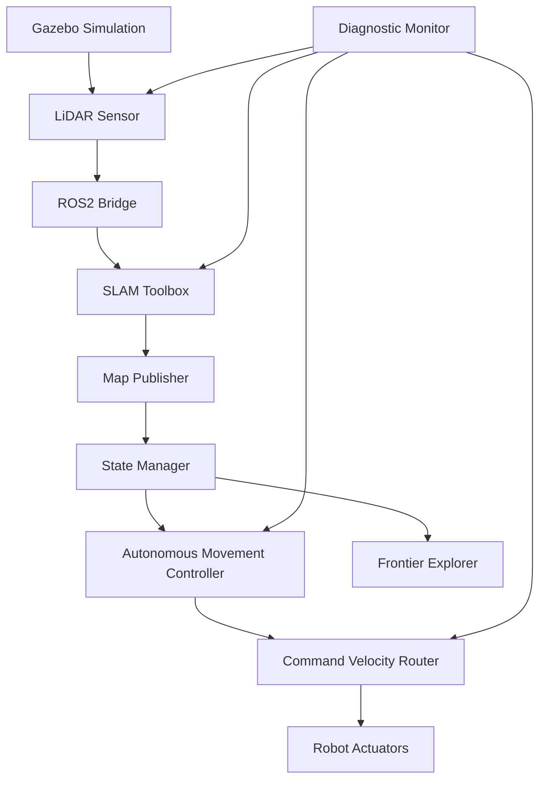

# Design Document

## Overview

This design addresses the critical issues preventing autonomous robot movement during the SLAM mapping phase. The current system has a circular dependency where SLAM waits for movement to generate maps, while the autonomous explorer waits for maps before moving. We'll implement a multi-stage autonomous system that can operate without pre-existing maps and ensure proper sensor data flow and command routing.

## Architecture

### System Components

1. **Autonomous Movement Controller** - Handles movement without requiring maps
2. **Sensor Data Pipeline** - Ensures reliable LiDAR data flow to SLAM
3. **Command Velocity Router** - Manages proper routing of movement commands
4. **State Manager** - Coordinates transitions between mapping and exploration modes
5. **Diagnostic Monitor** - Provides real-time system health monitoring

### Component Interactions



## Components and Interfaces

### 1. Autonomous Movement Controller

**Purpose:** Provides autonomous movement capabilities that don't depend on existing maps.

**Interfaces:**
- **Input:** State commands from State Manager
- **Output:** Twist messages to `/cmd_vel_autonomous`
- **Parameters:** Movement patterns, speeds, durations

**Movement Strategies:**
- **Spiral Pattern:** Expanding spiral for open areas
- **Grid Pattern:** Systematic grid coverage
- **Wall Following:** Follow walls when detected
- **Random Walk:** Controlled random movement with obstacle avoidance

### 2. Sensor Data Pipeline

**Purpose:** Ensures reliable sensor data flow from Gazebo to SLAM.

**Components:**
- **LiDAR Bridge Validator:** Monitors `/scan` topic health
- **Fallback Data Generator:** Provides synthetic data if sensors fail
- **Data Quality Monitor:** Validates scan data integrity

**Interfaces:**
- **Input:** Raw sensor data from Gazebo
- **Output:** Validated `/scan` data to SLAM
- **Monitoring:** Publishes sensor health status

### 3. Command Velocity Router

**Purpose:** Manages proper routing and prioritization of movement commands.

**Enhanced Twist Mux Configuration:**
```yaml
topics:
  autonomous_mapping:
    topic: /cmd_vel_autonomous
    timeout: 2.0
    priority: 50  # Between teleop and navigation
  
  navigation:
    topic: /cmd_vel_nav
    timeout: 1.0
    priority: 10
  
  teleop:
    topic: /cmd_vel_teleop
    timeout: 1.0
    priority: 100
```

### 4. State Manager

**Purpose:** Coordinates system behavior based on available data and system state.

**States:**
1. **INITIALIZATION** - System startup, sensor validation
2. **AUTONOMOUS_MAPPING** - Moving without maps for initial mapping
3. **FRONTIER_EXPLORATION** - Map-based exploration when map is available
4. **COMPLETED** - Exploration finished

**State Transitions:**
- INITIALIZATION → AUTONOMOUS_MAPPING (when sensors ready)
- AUTONOMOUS_MAPPING → FRONTIER_EXPLORATION (when sufficient map data available)
- FRONTIER_EXPLORATION → COMPLETED (when no more frontiers)

### 5. Diagnostic Monitor

**Purpose:** Provides comprehensive system monitoring and debugging capabilities.

**Monitoring Targets:**
- Topic publication rates and data quality
- Sensor data availability and validity
- Movement command delivery and execution
- SLAM processing status and map generation
- System performance metrics

## Data Models

### Movement Command Structure
```python
class AutonomousMovementCommand:
    pattern_type: str  # "spiral", "grid", "wall_follow", "random"
    linear_velocity: float
    angular_velocity: float
    duration: float
    safety_enabled: bool
```

### System State Structure
```python
class SystemState:
    current_mode: str
    sensors_ready: bool
    map_available: bool
    map_quality_score: float
    movement_active: bool
    last_command_time: float
```

### Diagnostic Data Structure
```python
class DiagnosticStatus:
    lidar_health: bool
    slam_processing: bool
    movement_responding: bool
    map_building: bool
    error_messages: List[str]
    performance_metrics: Dict[str, float]
```

## Error Handling

### Sensor Failures
- **LiDAR Unavailable:** Switch to fallback synthetic data generator
- **Bridge Failures:** Restart bridge components automatically
- **Data Corruption:** Filter and interpolate corrupted scan data

### Movement Issues
- **Command Not Reaching Robot:** Diagnose twist mux routing
- **Robot Not Moving:** Check Gazebo physics and joint configurations
- **Collision Detection:** Implement emergency stop and recovery

### SLAM Problems
- **No Map Generation:** Verify sensor data quality and SLAM parameters
- **Poor Map Quality:** Adjust movement patterns for better coverage
- **Memory Issues:** Monitor and manage SLAM memory usage

## Testing Strategy

### Unit Tests
- Individual component functionality
- Movement pattern generation
- Sensor data validation
- State transition logic

### Integration Tests
- End-to-end sensor data flow
- Command velocity routing
- State manager coordination
- Multi-component interaction

### System Tests
- Complete autonomous mapping scenarios
- Failure recovery testing
- Performance benchmarking
- Long-duration stability tests

### Simulation Tests
- Various Gazebo world environments
- Different robot configurations
- Sensor failure scenarios
- Network latency simulation

## Performance Considerations

### Real-time Requirements
- Movement commands: 10 Hz minimum
- Sensor data processing: Match sensor rates (10 Hz LiDAR)
- State updates: 5 Hz for responsive behavior
- Diagnostic monitoring: 1 Hz for efficiency

### Resource Management
- Memory usage monitoring for SLAM
- CPU usage optimization for real-time performance
- Network bandwidth management for topic communication
- Disk space management for map storage

### Scalability
- Support for multiple robots (future)
- Configurable movement patterns
- Adjustable performance parameters
- Modular component architecture