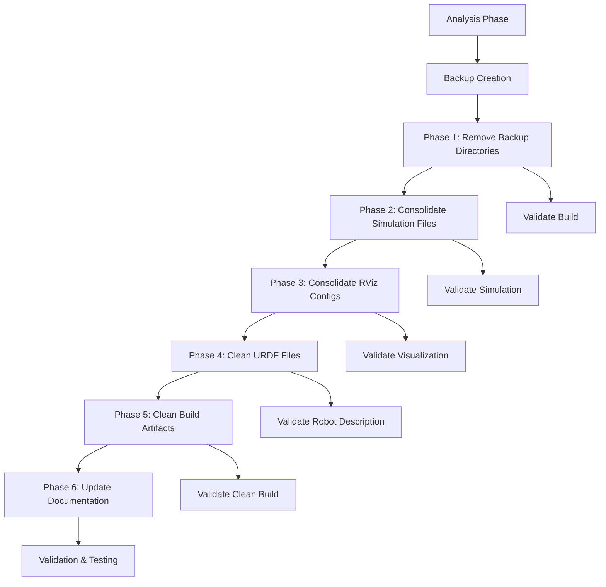

# Design Document

## Overview

This design outlines a systematic approach to cleaning up the Dojo robot codebase by removing redundancies, consolidating duplicate files, and establishing clear organizational patterns. The cleanup will be performed in phases to minimize risk and ensure no essential functionality is lost.

## Architecture

### Cleanup Strategy Architecture

The cleanup follows a phased approach with validation at each step:



### File Organization Strategy

**Before Cleanup:**
- Multiple backup directories with outdated packages
- 17+ simulation launch files across different locations
- 10+ RViz configuration files with overlapping purposes
- Multiple URDF files with unclear relationships
- Scattered backup files throughout the codebase

**After Cleanup:**
- Single source of truth for each file type
- Clear naming conventions
- Logical file organization within ROS2 package structure
- Comprehensive documentation of file purposes

## Components and Interfaces

### 1. Backup Directory Removal Component

**Purpose:** Safely remove backup directories and scattered backup files

**Interface:**
- Input: List of backup directories and files to remove
- Output: Clean source tree without backup artifacts
- Validation: Ensure no active dependencies on backup content

**Implementation:**
- Scan for backup directories (`backup_packages/`, `backup_redundant_launch_files/`)
- Identify scattered `.backup` files
- Verify no active references to backup content
- Remove backup directories and files
- Update any documentation references

### 2. Simulation File Consolidation Component

**Purpose:** Consolidate multiple simulation launch files into essential ones

**Target Structure:**
```
src/robot_gazebo/launch/
├── gazebo.launch.py          # Basic Gazebo startup
└── simulation.launch.py      # Complete simulation with robot

scripts/
├── launch_simulation.sh      # Simple simulation startup script
└── (remove other simulation scripts)
```

**Consolidation Rules:**
- Keep `gazebo.launch.py` for basic Gazebo startup
- Keep `simulation.launch.py` as primary simulation launcher
- Keep one simulation script in scripts/ directory
- Remove redundant and duplicate launch files
- Merge functionality where appropriate

### 3. RViz Configuration Consolidation Component

**Purpose:** Reduce RViz configurations to essential, distinct purposes

**Target Structure:**
```
src/robot_description/rviz/
├── robot_display.rviz        # Basic robot visualization
└── robot_simulation.rviz     # Simulation visualization

src/robot_gazebo/rviz/
└── simulation.rviz           # Gazebo simulation specific

src/robot_perception/rviz/
└── perception.rviz           # Perception system visualization
```

**Consolidation Rules:**
- Maximum 3 RViz configs per package
- Each config has distinct, documented purpose
- Merge similar configurations
- Use descriptive naming convention

### 4. URDF File Cleanup Component

**Purpose:** Establish clear URDF file hierarchy and remove redundants

**Target Structure:**
```
src/robot_description/urdf/
├── robot.urdf.xacro          # Primary robot description
├── robot.urdf                # Compiled version (auto-generated)
├── common_properties.xacro   # Shared properties
└── sensors/                  # Sensor-specific xacro files
    └── rplidar.urdf.xacro
```

**Cleanup Rules:**
- Keep `robot.urdf.xacro` as primary source
- Keep compiled `robot.urdf` for runtime use
- Remove backup and alternative versions
- Remove orphaned URDF files from root directory
- Ensure xacro-to-urdf compilation consistency

### 5. Configuration File Deduplication Component

**Purpose:** Remove duplicate configuration files and establish clear purposes

**Deduplication Strategy:**
- Compare configuration files with similar names
- Merge configurations with identical or near-identical content
- Establish clear naming conventions
- Document differences between remaining similar configs

### 6. Build Artifact Management Component

**Purpose:** Clean build artifacts and establish proper .gitignore

**Target .gitignore Structure:**
```
# Build artifacts
build/
install/
log/

# Python cache
__pycache__/
*.pyc
*.pyo

# IDE files
.vscode/settings.json
.idea/

# Temporary files
*.tmp
*.temp
*~
```

## Data Models

### File Classification Model

```python
class FileClassification:
    essential: bool          # Must keep
    redundant: bool         # Can be removed
    backup: bool           # Backup file to remove
    generated: bool        # Build artifact
    purpose: str          # Documented purpose
    dependencies: List[str] # Files that depend on this
```

### Cleanup Action Model

```python
class CleanupAction:
    action_type: str      # 'remove', 'merge', 'rename', 'move'
    source_files: List[str]
    target_file: str
    validation_required: bool
    rollback_info: dict
```

## Error Handling

### Validation Strategies

1. **Pre-cleanup Validation:**
   - Verify no active dependencies on files to be removed
   - Create backup of current state
   - Test build system before cleanup

2. **Phase-by-phase Validation:**
   - Test build after each cleanup phase
   - Validate functionality after each major change
   - Rollback capability for each phase

3. **Post-cleanup Validation:**
   - Full system build test
   - Simulation launch test
   - Hardware launch test (if available)

### Error Recovery

- Maintain rollback information for each cleanup action
- Automated rollback scripts for each phase
- Clear error messages with recovery suggestions
- Validation checkpoints throughout process

## Testing Strategy

### Validation Tests

1. **Build System Tests:**
   - `colcon build --packages-select <package>` for each modified package
   - Full workspace build test
   - Clean build from scratch

2. **Launch File Tests:**
   - Syntax validation for all remaining launch files
   - Parameter validation
   - Dependency checking

3. **Simulation Tests:**
   - Basic Gazebo launch test
   - Robot spawning test
   - RViz visualization test

4. **Integration Tests:**
   - Full system startup test
   - Mode switching test (simulation/hardware)
   - Configuration loading test

### Test Automation

```bash
# Automated validation script
./scripts/validate_cleanup.sh
├── validate_build_system()
├── validate_launch_files()
├── validate_simulation()
├── validate_configurations()
└── generate_cleanup_report()
```

## Implementation Phases

### Phase 1: Backup Directory Removal
- Remove `backup_packages/` directory
- Remove `backup_redundant_launch_files/` directory
- Remove scattered `.backup` files
- Validate build system still works

### Phase 2: Simulation File Consolidation
- Analyze all simulation launch files
- Identify essential vs redundant files
- Consolidate functionality
- Update documentation
- Test simulation launching

### Phase 3: RViz Configuration Consolidation
- Analyze all RViz configurations
- Merge similar configurations
- Rename for clarity
- Test visualization launching

### Phase 4: URDF File Cleanup
- Identify primary URDF files
- Remove backup/alternative versions
- Validate robot description loading
- Test in both simulation and hardware modes

### Phase 5: Configuration Deduplication
- Compare similar configuration files
- Merge or remove duplicates
- Update references
- Test configuration loading

### Phase 6: Build Artifact Management
- Create comprehensive .gitignore
- Clean existing build artifacts
- Test clean build process
- Document build artifact management

### Phase 7: Documentation Update
- Document all changes made
- Create file organization guide
- Update README files
- Create maintenance guidelines