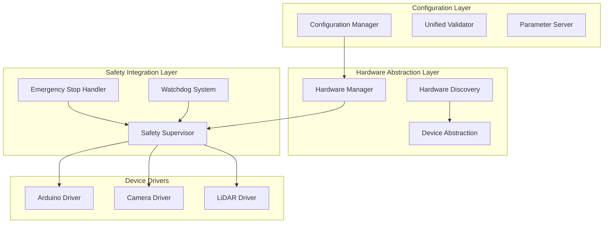

# Design Document

## Overview

This design addresses the comprehensive fixes needed for the Dojo Robot ROS2 platform. The solution implements a robust hardware abstraction layer, unified configuration management, integrated safety systems, and improved build processes to transform the system from prototype to production-ready.

## Architecture

### System Architecture Improvements



### Key Design Principles

1. **Single Source of Truth**: All robot parameters centralized in one configuration
2. **Hardware Abstraction**: Device-agnostic interfaces with automatic discovery
3. **Graceful Degradation**: System continues operating with reduced functionality when components fail
4. **Safety First**: Multiple safety layers with fail-safe defaults
5. **Configuration Validation**: Comprehensive parameter checking before system startup

## Components and Interfaces

### 1. Configuration Manager

**Purpose**: Centralized configuration management with validation and consistency checking.

**Key Features**:
- Single master configuration file (`robot_config.yaml`)
- Automatic parameter propagation to all subsystems
- Configuration validation and conflict detection
- Runtime parameter updates with safety checks

**Interface**:
```python
class ConfigurationManager:
    def load_master_config(self) -> Dict
    def validate_configuration(self) -> ValidationResult
    def propagate_parameters(self) -> None
    def detect_conflicts(self) -> List[ConfigConflict]
```

### 2. Hardware Discovery Service

**Purpose**: Automatic detection and configuration of hardware devices.

**Key Features**:
- Serial port scanning for Arduino devices
- Camera capability detection (resolution, formats)
- LiDAR model identification and configuration
- USB device monitoring and reconnection

**Interface**:
```python
class HardwareDiscovery:
    def scan_serial_devices(self) -> List[SerialDevice]
    def detect_cameras(self) -> List[CameraDevice]
    def find_lidar_devices(self) -> List[LidarDevice]
    def monitor_usb_changes(self) -> None
```

### 3. Enhanced Hardware Manager

**Purpose**: Coordinated hardware management with health monitoring and recovery.

**Key Features**:
- Component lifecycle management
- Health monitoring with metrics
- Automatic recovery procedures
- Graceful degradation strategies

**Interface**:
```python
class EnhancedHardwareManager:
    def register_component(self, component: HardwareComponent) -> None
    def monitor_health(self) -> HealthStatus
    def attempt_recovery(self, component: str) -> RecoveryResult
    def degrade_gracefully(self, failed_components: List[str]) -> None
```

### 4. Safety Supervisor

**Purpose**: Integrated safety system with emergency stop and watchdog functionality.

**Key Features**:
- Emergency stop coordination across all components
- Velocity limiting and command filtering
- Obstacle avoidance integration
- Watchdog timers for critical components

**Interface**:
```python
class SafetySupervisor:
    def trigger_emergency_stop(self, reason: str) -> None
    def clear_emergency_stop(self) -> bool
    def enforce_velocity_limits(self, cmd: Twist) -> Twist
    def check_safety_conditions(self) -> SafetyStatus
```

## Data Models

### Master Configuration Schema

```yaml
# robot_config.yaml - Single source of truth
robot:
  physical_parameters:
    wheel_base: 0.26          # meters
    wheel_radius: 0.030       # meters
    max_linear_velocity: 0.5  # m/s
    max_angular_velocity: 1.0 # rad/s
    
  hardware:
    arduino:
      auto_discover: true
      fallback_port: "/dev/ttyACM0"
      baud_rate: 115200
      timeout: 1.0
      
    camera:
      auto_discover: true
      preferred_resolution: [640, 480]
      fps: 30.0
      
    lidar:
      auto_discover: true
      fallback_port: "/dev/ttyUSB0"
      scan_frequency: 10.0
      
  safety:
    emergency_stop_timeout: 0.5  # seconds
    obstacle_stop_distance: 0.3  # meters
    command_timeout: 1.0         # seconds
    watchdog_interval: 2.0       # seconds
    
  system:
    use_simulation: false
    log_level: "INFO"
    diagnostics_rate: 2.0        # Hz
```

### Device Abstraction Models

```python
@dataclass
class HardwareDevice:
    name: str
    device_type: str
    connection_info: Dict
    capabilities: Dict
    status: DeviceStatus
    last_seen: datetime

@dataclass
class SafetyState:
    emergency_stop_active: bool
    safety_violations: List[str]
    last_command_time: datetime
    watchdog_status: Dict[str, datetime]
```

## Error Handling

### Hardware Error Recovery Strategy

1. **Detection**: Continuous monitoring of device communication
2. **Classification**: Categorize errors (temporary, permanent, configuration)
3. **Recovery**: Automated recovery procedures based on error type
4. **Escalation**: Graceful degradation if recovery fails
5. **Notification**: Comprehensive logging and operator alerts

### Safety Error Handling

1. **Immediate Response**: Emergency stop for critical safety violations
2. **Isolation**: Disable affected subsystems while maintaining core functionality
3. **Recovery Validation**: Require explicit confirmation before resuming operations
4. **Audit Trail**: Complete logging of all safety events

## Testing Strategy

### Unit Testing
- Configuration validation logic
- Hardware discovery algorithms
- Safety system responses
- Error recovery procedures

### Integration Testing
- Hardware manager with real devices
- Safety system integration
- Configuration propagation
- Emergency stop coordination

### System Testing
- Full system startup with various hardware configurations
- Failure simulation and recovery testing
- Performance under degraded conditions
- Safety system validation

### Hardware-in-the-Loop Testing
- Real Arduino, camera, and LiDAR integration
- USB disconnect/reconnect scenarios
- Emergency stop response times
- Configuration change validation

## Implementation Phases

### Phase 1: Configuration Management
1. Create unified configuration schema
2. Implement configuration manager
3. Add validation and conflict detection
4. Update all existing configuration files

### Phase 2: Hardware Abstraction
1. Implement hardware discovery service
2. Create device abstraction layer
3. Add automatic reconnection logic
4. Update hardware drivers

### Phase 3: Safety Integration
1. Implement safety supervisor
2. Add emergency stop coordination
3. Integrate watchdog systems
4. Add velocity limiting

### Phase 4: Build System Improvements
1. Fix legacy package conflicts
2. Add dependency validation
3. Improve error reporting
4. Add configuration validation to build

### Phase 5: Testing and Validation
1. Comprehensive testing suite
2. Hardware validation
3. Performance optimization
4. Documentation updates