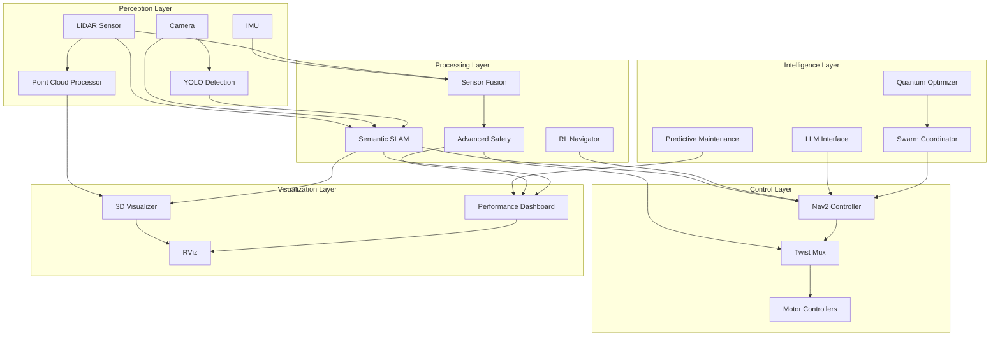

# Design Document

## Overview

This design document outlines the technical architecture for transforming the Dojo robot into a state-of-the-art autonomous system. The implementation builds upon existing foundations (semantic SLAM, advanced safety, natural language interface) and adds cutting-edge capabilities organized by priority.

The design follows a modular, incremental approach where each feature can be developed and tested independently while integrating seamlessly with the existing system. The architecture emphasizes:

- **Modularity**: Each feature is a self-contained ROS2 package or node
- **Scalability**: Support for single and multi-robot deployments
- **Performance**: Real-time operation with minimal latency
- **Maintainability**: Clean code with clear interfaces and documentation
- **Extensibility**: Easy to add new features without breaking existing functionality

## Architecture

### System Architecture Overview



### Package Organization

The system is organized into ROS2 packages with clear responsibilities:

```
src/
├── robot_semantic_slam/          # Semantic SLAM & object-aware navigation
│   ├── semantic_slam_node.py     # YOLO + SLAM integration
│   ├── semantic_interface.py     # Natural language commands
│   ├── advanced_safety_system.py # Predictive safety
│   └── enhanced_visualizer.py    # 3D visualization
├── robot_rl_navigation/          # NEW: Reinforcement learning navigation
│   ├── rl_navigator.py           # RL-based path planner
│   ├── training_env.py           # Gym environment for training
│   └── policy_manager.py         # Policy loading/saving
├── robot_swarm/                  # NEW: Multi-robot coordination
│   ├── swarm_coordinator.py      # Distributed task allocation
│   ├── formation_controller.py   # Formation control
│   └── collaborative_mapper.py   # Shared mapping
├── robot_maintenance/            # NEW: Predictive maintenance
│   ├── health_monitor.py         # System health tracking
│   ├── anomaly_detector.py       # ML-based anomaly detection
│   └── maintenance_scheduler.py  # Predictive scheduling
├── robot_llm_interface/          # NEW: LLM integration
│   ├── llm_controller.py         # LLM command processing
│   ├── task_planner.py           # Multi-step task planning
│   └── explanation_generator.py  # Human-readable explanations
├── robot_quantum/                # NEW: Quantum-inspired optimization
│   ├── quantum_planner.py        # Quantum path planning
│   └── qubo_solver.py            # QUBO problem solver
└── robot_visualization/          # Enhanced visualization
    ├── pointcloud_processor.py   # 3D point cloud generation
    ├── performance_dashboard.py  # Real-time metrics
    └── world_manager.py          # Multi-world support
```

## Components and Interfaces

### Priority 1 Components

#### 1.1 Enhanced Semantic SLAM Integration

**Component**: `SemanticSLAMNode` (existing, to be enhanced)

**Responsibilities**:
- Integrate YOLO detections with SLAM map coordinates
- Maintain persistent semantic object database
- Provide object-aware navigation interface
- Publish semantic map updates

**Key Interfaces**:
```python
# Input Topics
/camera/image_raw          # sensor_msgs/Image
/scan                      # sensor_msgs/LaserScan
/map                       # nav_msgs/OccupancyGrid
/robot_pose                # geometry_msgs/PoseStamped

# Output Topics
/semantic_map              # std_msgs/String (JSON)
/semantic_image            # sensor_msgs/Image (annotated)
/navigate_to_object        # geometry_msgs/PoseStamped

# Services
/find_object               # robot_interfaces/FindObject
/list_objects              # robot_interfaces/ListObjects
```

**Data Model**:
```python
class SemanticObject:
    object_id: str
    class_name: str
    position: Point3D
    confidence: float
    last_seen: Time
    detection_count: int
    bounding_box: BoundingBox3D
```

**Enhancement Strategy**:
- Add depth estimation using LiDAR-camera fusion
- Implement object persistence with timeout mechanism
- Add spatial indexing for fast nearest-object queries
- Integrate with Nav2 for semantic goal navigation

#### 1.2 3D Point Cloud Visualization

**Component**: `PointCloudProcessor` (new)

**Responsibilities**:
- Convert 2D LiDAR scans to 3D point clouds
- Accumulate scans for dense 3D mapping
- Color-code points by height and intensity
- Publish PointCloud2 messages for RViz

**Key Interfaces**:
```python
# Input Topics
/scan                      # sensor_msgs/LaserScan
/robot_pose                # geometry_msgs/PoseStamped

# Output Topics
/pointcloud                # sensor_msgs/PointCloud2
/dense_map                 # sensor_msgs/PointCloud2

# Parameters
~accumulation_time: 10.0   # seconds
~voxel_size: 0.05          # meters
~max_points: 1000000       # point limit
```

**Implementation Approach**:
- Use `sensor_msgs/PointCloud2` for efficient data transfer
- Implement voxel grid filtering for downsampling
- Add color mapping based on height (rainbow gradient)
- Support both real-time and accumulated views

#### 1.3 Real-Time Performance Dashboard

**Component**: `PerformanceDashboard` (new)

**Responsibilities**:
- Monitor system resource usage (CPU, memory, network)
- Track robotics-specific metrics (detection rate, nav efficiency)
- Publish dashboard data for RViz display
- Generate performance alerts

**Key Interfaces**:
```python
# Input Topics
/semantic_map              # std_msgs/String
/plan                      # nav_msgs/Path
/cmd_vel                   # geometry_msgs/Twist
/safety_status             # std_msgs/String

# Output Topics
/performance_metrics       # robot_interfaces/PerformanceMetrics
/dashboard_data            # visualization_msgs/MarkerArray
/performance_alerts        # std_msgs/String

# Metrics Published
- CPU usage (%)
- Memory usage (MB)
- Network bandwidth (Mbps)
- Detection rate (objects/sec)
- Navigation efficiency (0-1)
- Mapping coverage (%)
- Safety level (0-4)
```

**Dashboard Layout** (RViz Panel):
```
┌─────────────────────────────────────┐
│ ROBOT PERFORMANCE DASHBOARD         │
├─────────────────────────────────────┤
│ System Health:                      │
│  CPU: ████████░░ 80%                │
│  Memory: ██████░░░░ 60%             │
│  Network: ███░░░░░░░ 30 Mbps        │
├─────────────────────────────────────┤
│ Navigation:                         │
│  Efficiency: ████████░░ 85%         │
│  Goal Distance: 3.2m                │
│  ETA: 12s                           │
├─────────────────────────────────────┤
│ Perception:                         │
│  Objects Detected: 15               │
│  Detection Rate: 8.5/sec            │
│  Map Coverage: 78%                  │
├─────────────────────────────────────┤
│ Safety:                             │
│  Level: NORMAL ✓                    │
│  Active Threats: 0                  │
│  Emergency Stop: READY              │
└─────────────────────────────────────┘
```

#### 1.4 Multi-World Simulation Environments

**Component**: `WorldManager` (new)

**Responsibilities**:
- Manage multiple Gazebo world files
- Provide world selection interface
- Configure robot spawn parameters per world
- Support dynamic world switching

**World Configurations**:
```yaml
worlds:
  house:
    file: house.world
    spawn_position: [0, 0, 0.1]
    description: "Residential environment with rooms"
    
  office:
    file: office.world
    spawn_position: [2, 2, 0.1]
    description: "Office with cubicles and meeting rooms"
    
  warehouse:
    file: warehouse.world
    spawn_position: [5, 5, 0.1]
    description: "Large warehouse with shelves"
    
  outdoor:
    file: outdoor.world
    spawn_position: [0, 0, 0.2]
    description: "Outdoor terrain with obstacles"
```

**Launch File Integration**:
```python
# complete_robot_simulation.launch.py
world = LaunchConfiguration('world', default='house')
world_file = PathJoinSubstitution([
    FindPackageShare('robot_gazebo'),
    'worlds',
    [world, '.world']
])
```

#### 1.5 Advanced Safety System Enhancements

**Component**: `AdvancedSafetySystem` (existing, to be enhanced)

**Enhancements**:
- Predictive collision avoidance (3-second horizon)
- Emergency behavior tree execution
- Human detection with increased safety margins
- Multi-threat prioritization

**Behavior Tree Structure**:
```
SafetyBehaviorTree
├── Sequence: Normal Operation
│   ├── Condition: No Threats Detected
│   └── Action: Allow Full Speed
├── Fallback: Threat Response
│   ├── Sequence: Critical Threat
│   │   ├── Condition: Critical Distance
│   │   └── Action: Emergency Stop
│   ├── Sequence: Human Detected
│   │   ├── Condition: Human in Range
│   │   └── Action: Maintain 1.5m Distance
│   ├── Sequence: Dynamic Obstacle
│   │   ├── Condition: Moving Obstacle
│   │   └── Action: Predictive Avoidance
│   └── Sequence: Static Obstacle
│       ├── Condition: Static Obstacle
│       └── Action: Slow Down
```

### Priority 2 Components

#### 2.1 Reinforcement Learning Navigation

**Component**: `RLNavigator` (new)

**Architecture**:
```python
class RLNavigator:
    """RL-based adaptive navigation system"""
    
    def __init__(self):
        self.policy_network = PPO_Policy()  # or SAC
        self.env = NavigationEnv()
        self.fallback_planner = Nav2Interface()
        
    def compute_action(self, observation):
        """Compute navigation action using RL policy"""
        if self.policy_network.is_confident(observation):
            return self.policy_network.predict(observation)
        else:
            return self.fallback_planner.get_action()
```

**Training Environment**:
```python
class NavigationEnv(gym.Env):
    """Gym environment for RL training"""
    
    observation_space = spaces.Box(
        low=-np.inf, high=np.inf, 
        shape=(64,),  # LiDAR + goal + velocity
        dtype=np.float32
    )
    
    action_space = spaces.Box(
        low=[-1, -1], high=[1, 1],  # [linear_vel, angular_vel]
        dtype=np.float32
    )
    
    def step(self, action):
        # Execute action in simulation
        # Calculate reward: progress + safety + efficiency
        # Return observation, reward, done, info
```

**Reward Function**:
```python
reward = (
    progress_reward * 1.0 +      # Distance to goal
    safety_reward * 2.0 +         # Collision avoidance
    efficiency_reward * 0.5 +     # Energy efficiency
    smoothness_reward * 0.3       # Path smoothness
)
```

#### 2.2 Multi-Robot Swarm Coordination

**Component**: `SwarmCoordinator` (new)

**Architecture**:
```python
class SwarmCoordinator:
    """Distributed multi-robot coordination"""
    
    def __init__(self, robot_id):
        self.robot_id = robot_id
        self.swarm_network = DDS_Network()
        self.task_allocator = DistributedAuction()
        self.formation_controller = FormationControl()
```

**Communication Protocol**:
```python
# Swarm Messages
class SwarmMessage:
    sender_id: str
    message_type: str  # 'task', 'status', 'discovery', 'formation'
    timestamp: Time
    data: dict

# Task Allocation
class Task:
    task_id: str
    task_type: str  # 'explore', 'goto', 'patrol'
    priority: int
    location: Point
    estimated_cost: float
```

**Formation Control**:
```python
formations = {
    'line': lambda n: [(i*spacing, 0) for i in range(n)],
    'wedge': lambda n: [(i*spacing, abs(i-n/2)*spacing) for i in range(n)],
    'circle': lambda n: [(r*cos(2*pi*i/n), r*sin(2*pi*i/n)) for i in range(n)]
}
```

#### 2.3 Predictive Maintenance System

**Component**: `HealthMonitor` (new)

**Monitoring Architecture**:
```python
class HealthMonitor:
    """AI-powered system health monitoring"""
    
    def __init__(self):
        self.anomaly_detector = IsolationForest()
        self.failure_predictor = LSTM_Predictor()
        self.health_metrics = {
            'motor_current': [],
            'motor_temperature': [],
            'sensor_noise': [],
            'battery_voltage': [],
            'cpu_temperature': []
        }
```

**Anomaly Detection**:
- Use Isolation Forest for unsupervised anomaly detection
- Train on normal operation data
- Detect deviations from normal patterns
- Generate alerts with severity levels

**Failure Prediction**:
- LSTM network trained on historical failure data
- Predict failure probability over time horizon
- Trigger maintenance when probability > 80%
- Provide estimated time to failure

#### 2.4 Advanced Multi-Modal Sensor Fusion

**Component**: `SensorFusion` (new)

**Fusion Architecture**:
```python
class ExtendedKalmanFilter:
    """EKF for multi-sensor fusion"""
    
    def __init__(self):
        self.state = np.zeros(6)  # [x, y, theta, vx, vy, omega]
        self.covariance = np.eye(6)
        
    def predict(self, control_input, dt):
        # Predict state using motion model
        
    def update_lidar(self, lidar_measurement):
        # Update with LiDAR measurement
        
    def update_camera(self, visual_odometry):
        # Update with visual odometry
        
    def update_imu(self, imu_measurement):
        # Update with IMU measurement
```

**Sensor Reliability Weighting**:
```python
reliability_scores = {
    'lidar': 0.9,      # High reliability
    'camera': 0.7,     # Medium (lighting dependent)
    'imu': 0.8,        # High for orientation
    'odometry': 0.6    # Medium (wheel slip)
}
```

### Priority 3 Components

#### 3.1 Embodied AI with Large Language Models

**Component**: `LLMController` (new)

**Architecture**:
```python
class LLMController:
    """LLM-powered natural language control"""
    
    def __init__(self):
        self.llm = LLaMA2_Interface()  # or GPT-4, Claude
        self.task_planner = HierarchicalPlanner()
        self.world_model = SemanticWorldModel()
```

**Command Processing Pipeline**:
```
User Command
    ↓
LLM Parsing & Understanding
    ↓
Task Decomposition
    ↓
Action Sequence Generation
    ↓
Execution with Monitoring
    ↓
Explanation Generation
```

**Example Interaction**:
```python
# User: "Go to the kitchen and bring me a coffee mug"

# LLM Processing:
parsed_command = {
    'primary_goal': 'retrieve_object',
    'object': 'coffee mug',
    'location': 'kitchen',
    'sub_tasks': [
        {'action': 'navigate', 'target': 'kitchen'},
        {'action': 'find_object', 'object': 'coffee mug'},
        {'action': 'grasp_object', 'object': 'coffee mug'},
        {'action': 'navigate', 'target': 'user_location'},
        {'action': 'release_object'}
    ]
}

# Execution with explanations:
"I'm navigating to the kitchen now..."
"I've arrived at the kitchen and I'm searching for a coffee mug..."
"I found a coffee mug on the counter. Approaching it now..."
"I'm bringing the mug to you..."
```

#### 3.2 Quantum-Inspired Optimization

**Component**: `QuantumPathPlanner` (new)

**Architecture**:
```python
class QuantumPathPlanner:
    """Quantum-inspired optimization for path planning"""
    
    def __init__(self):
        self.qubo_solver = SimulatedAnnealing()  # Classical simulation
        # self.quantum_backend = DWave()  # If quantum hardware available
```

**QUBO Formulation**:
```python
def formulate_multi_robot_path_planning(robots, goals, obstacles):
    """
    Formulate as Quadratic Unconstrained Binary Optimization
    Variables: x[robot][position][time] ∈ {0, 1}
    """
    Q = np.zeros((n_vars, n_vars))
    
    # Objective: Minimize total path length
    for robot in robots:
        for t in range(time_horizon):
            # Add distance costs
            
    # Constraints: Collision avoidance
    for r1, r2 in robot_pairs:
        for t in range(time_horizon):
            # Add collision penalty
            
    return Q
```

#### 3.3 Neuromorphic Computing Integration

**Component**: `NeuromorphicProcessor` (new)

**Architecture**:
```python
class SpikingNeuralNetwork:
    """Spiking neural network for event-based processing"""
    
    def __init__(self):
        self.neurons = []
        self.synapses = []
        self.membrane_potentials = np.zeros(n_neurons)
```

**Event-Based Vision Processing**:
- Convert camera frames to spike trains
- Process with spiking neural network
- Extract motion and object information
- Ultra-low latency (<1ms) and power consumption

#### 3.4 Digital Twin Technology

**Component**: `RobotDigitalTwin` (new)

**Architecture**:
```python
class RobotDigitalTwin:
    """Real-time digital twin for prediction and optimization"""
    
    def __init__(self):
        self.physics_sim = PyBullet()
        self.ai_predictor = TransformerModel()
        self.real_robot = RobotInterface()
        
    def sync_state(self):
        """Continuously sync with physical robot"""
        real_state = self.real_robot.get_state()
        self.physics_sim.set_state(real_state)
        
    def predict_future(self, horizon=10.0):
        """Predict robot behavior over time horizon"""
        predictions = []
        for t in np.linspace(0, horizon, 100):
            pred_state = self.ai_predictor.predict(t)
            predictions.append(pred_state)
        return predictions
```

## Data Models

### Semantic Object Model
```python
@dataclass
class SemanticObject:
    object_id: str
    class_name: str
    position: Point3D
    orientation: Quaternion
    bounding_box: BoundingBox3D
    confidence: float
    last_seen: Time
    detection_count: int
    velocity: Vector3D  # For dynamic objects
    attributes: Dict[str, Any]
```

### Performance Metrics Model
```python
@dataclass
class PerformanceMetrics:
    timestamp: Time
    cpu_usage: float  # 0-100%
    memory_usage: float  # MB
    network_bandwidth: float  # Mbps
    detection_rate: float  # objects/sec
    navigation_efficiency: float  # 0-1
    mapping_coverage: float  # 0-1
    safety_level: int  # 0-4
    active_threats: int
```

### Swarm Task Model
```python
@dataclass
class SwarmTask:
    task_id: str
    task_type: str  # 'explore', 'goto', 'patrol', 'search'
    priority: int  # 0-10
    location: Point
    area: Polygon  # For area-based tasks
    estimated_cost: float
    assigned_robot: Optional[str]
    status: str  # 'pending', 'assigned', 'in_progress', 'completed'
    deadline: Optional[Time]
```

## Error Handling

### Graceful Degradation Strategy

1. **Sensor Failure**:
   - Detect sensor failure through timeout or invalid data
   - Switch to alternative sensors
   - Reduce speed and increase caution
   - Log failure and alert operator

2. **RL Policy Failure**:
   - Monitor policy confidence scores
   - Fall back to Nav2 when confidence < threshold
   - Continue collecting data for retraining
   - Gradually re-enable RL as confidence improves

3. **Communication Failure** (Multi-robot):
   - Detect communication loss through heartbeat timeout
   - Switch to autonomous operation
   - Attempt to complete assigned tasks independently
   - Periodically retry connection

4. **LLM Service Unavailable**:
   - Fall back to pattern-based command parsing
   - Use cached responses for common commands
   - Queue complex commands for later processing
   - Notify user of limited functionality

### Safety Overrides

```python
class SafetyOverride:
    """Multi-level safety override system"""
    
    LEVELS = {
        'NORMAL': 0,      # All safety systems active
        'REDUCED': 1,     # Some safety margins reduced
        'MINIMAL': 2,     # Only critical safety active
        'DISABLED': 3     # Manual control (emergency only)
    }
    
    def apply_override(self, level, duration=None):
        """Apply safety override with optional timeout"""
        if level >= self.LEVELS['MINIMAL']:
            self.require_operator_confirmation()
        
        self.current_level = level
        if duration:
            self.schedule_auto_restore(duration)
```

## Testing Strategy

### Unit Testing
- Test each component independently
- Mock ROS2 interfaces
- Verify correct behavior for edge cases
- Achieve 80%+ code coverage

### Integration Testing
- Test component interactions
- Verify message passing
- Test with simulated sensors
- Validate end-to-end workflows

### System Testing
- Full system tests in Gazebo
- Test all feature combinations
- Performance benchmarking
- Stress testing (high load scenarios)

### Validation Metrics
```python
validation_metrics = {
    'semantic_slam': {
        'object_detection_accuracy': 0.95,
        'position_accuracy': 0.02,  # meters
        'map_consistency': 0.98
    },
    'rl_navigation': {
        'success_rate': 0.90,
        'collision_rate': 0.05,
        'path_efficiency': 0.85
    },
    'safety_system': {
        'threat_detection_rate': 0.99,
        'false_positive_rate': 0.10,
        'emergency_stop_latency': 0.100  # seconds
    }
}
```

## Performance Optimization

### Computational Efficiency
- Use GPU acceleration for YOLO and RL inference
- Implement multi-threading for parallel processing
- Optimize message serialization
- Cache frequently accessed data

### Memory Management
- Limit point cloud size with voxel filtering
- Implement sliding window for historical data
- Use shared memory for large messages
- Regular garbage collection

### Network Optimization
- Compress large messages (images, point clouds)
- Use QoS profiles appropriately
- Batch small messages when possible
- Implement message prioritization

## Deployment Strategy

### Phase 1 Deployment
1. Deploy enhanced semantic SLAM
2. Add 3D visualization
3. Implement performance dashboard
4. Add multi-world support
5. Enhance safety system

### Phase 2 Deployment
1. Deploy RL navigation (training mode)
2. Implement predictive maintenance
3. Add sensor fusion
4. Deploy multi-robot infrastructure

### Phase 3 Deployment
1. Integrate LLM interface
2. Add quantum-inspired optimization
3. Implement neuromorphic processing
4. Deploy digital twin

### Rollback Plan
- Maintain previous stable version
- Feature flags for gradual rollout
- Automated rollback on critical failures
- Comprehensive logging for debugging
