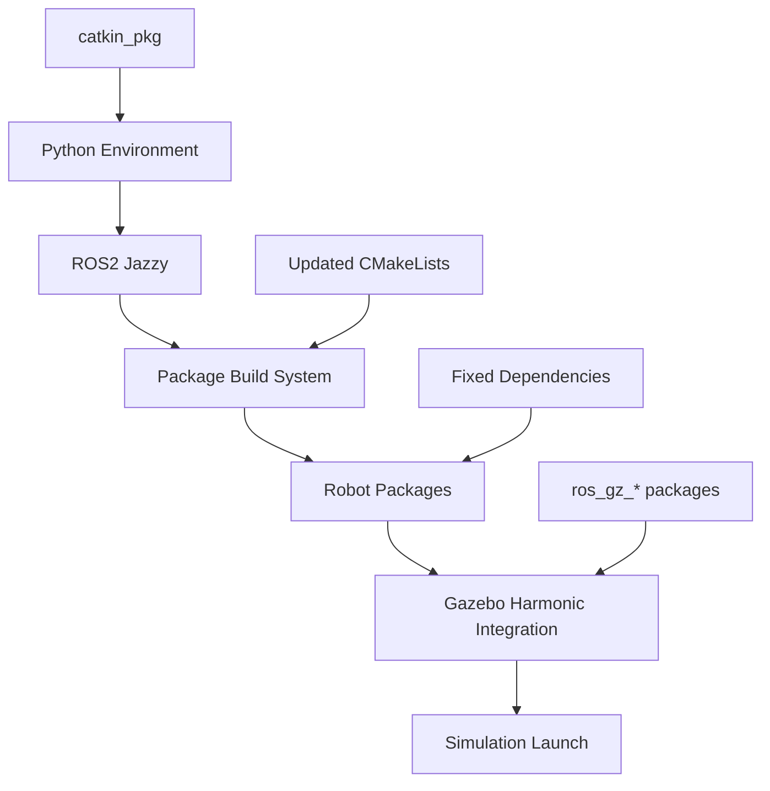

# Design Document

## Overview

This design outlines the technical approach to complete the ROS2 Jazzy + Gazebo Harmonic migration by fixing the identified bugs and compatibility issues. The primary goal is to ensure the complete robot simulation launches successfully with `ros2 launch complete_robot_simulation.launch.py`.

Based on the analysis, the main issues to address are:
1. Python dependency conflicts (catkin_pkg missing, conda environment interference)
2. CMakeLists.txt files referencing deprecated Gazebo Classic packages
3. Package dependency mismatches between Gazebo Classic and Gazebo Harmonic
4. Launch file integration issues
5. URDF plugin compatibility validation

## Architecture

### Migration Strategy

The migration follows a **fix-in-place** approach rather than a complete rewrite:

```
Current State (Partially Migrated)
├── ROS2 Jazzy ✓ (Installed)
├── Gazebo Harmonic ✓ (Installed) 
├── Launch Files ✓ (Updated)
├── URDF Files ✓ (Updated)
├── World Files ✓ (Updated)
└── Build System ❌ (Needs Fixes)
    ├── Python Dependencies ❌
    ├── CMakeLists.txt ❌
    └── Package Dependencies ❌
```

### Component Architecture



## Components and Interfaces

### 1. Python Environment Management

**Problem**: Conda environment interfering with ROS2 build system, missing catkin_pkg

**Solution**: 
- Install missing Python dependencies in the correct environment
- Configure build system to use system Python for ROS2 builds
- Ensure catkin_pkg and other required packages are available

**Interface**:
```bash
# Environment setup
export PYTHONPATH=/opt/ros/jazzy/lib/python3.12/site-packages:$PYTHONPATH
pip install catkin_pkg empy lark
```

### 2. Build System Updates

**Problem**: CMakeLists.txt files reference deprecated Gazebo Classic packages

**Current Issues**:
```cmake
# DEPRECATED - Gazebo Classic
find_package(gazebo_ros REQUIRED)
find_package(gazebo_plugins REQUIRED)
find_package(gazebo_dev REQUIRED)
```

**Solution**:
```cmake
# UPDATED - Gazebo Harmonic
find_package(ros_gz_sim REQUIRED)
find_package(ros_gz_bridge REQUIRED)
find_package(ros_gz_interfaces REQUIRED)
```

### 3. Package Dependency Resolution

**Problem**: Package.xml files may reference incompatible packages

**Solution Strategy**:
- Audit all package.xml files for Gazebo Classic references
- Replace with Gazebo Harmonic equivalents
- Ensure all ros_gz_* packages are properly declared

**Dependency Mapping**:
```xml
<!-- OLD -->
<depend>gazebo_ros</depend>
<depend>gazebo_plugins</depend>

<!-- NEW -->
<depend>ros_gz_sim</depend>
<depend>ros_gz_bridge</depend>
```

### 4. Launch System Integration

**Current State**: Launch files already updated for Gazebo Harmonic
**Validation Needed**: Ensure all referenced packages exist and work correctly

**Key Components**:
- `ros_gz_sim` for Gazebo launching
- `ros_gz_bridge` for topic bridging
- Proper parameter passing and node configuration

### 5. URDF and World File Validation

**Current State**: Files already updated for Gazebo Harmonic
**Validation Needed**: Ensure plugins load correctly

**Plugin Validation**:
```xml
<!-- Gazebo Harmonic Plugin Format -->
<plugin filename="DiffDrive" name="gz::sim::systems::DiffDrive">
  <!-- Plugin configuration -->
</plugin>
```

## Data Models

### Build Configuration Model

```yaml
build_config:
  ros_distro: "jazzy"
  gazebo_version: "harmonic"
  python_version: "3.12"
  dependencies:
    system:
      - catkin_pkg
      - empy
      - lark
    ros:
      - ros_gz_sim
      - ros_gz_bridge
      - ros_gz_interfaces
    gazebo:
      - gz-harmonic
```

### Package Dependency Model

```yaml
package_dependencies:
  robot_gazebo:
    build_depends:
      - ament_cmake
      - ros_gz_sim
    exec_depends:
      - ros_gz_bridge
      - ros_gz_interfaces
  robot_description:
    build_depends:
      - ament_cmake
      - urdf
      - xacro
```

## Error Handling

### Build Error Recovery

1. **Python Import Errors**:
   - Detect missing Python packages
   - Install in correct environment
   - Retry build with proper PYTHONPATH

2. **CMake Configuration Errors**:
   - Identify deprecated package references
   - Replace with Gazebo Harmonic equivalents
   - Update find_package() calls

3. **Missing Dependencies**:
   - Run rosdep to identify missing packages
   - Install missing ROS packages
   - Verify package availability

### Runtime Error Handling

1. **Launch Failures**:
   - Check for missing launch dependencies
   - Validate parameter files exist
   - Ensure proper topic bridging

2. **Gazebo Integration Issues**:
   - Verify ros_gz_bridge is running
   - Check topic mapping configuration
   - Validate plugin loading

## Testing Strategy

### Primary Test: Simulation Launch

**Single Integration Test**:
```bash
ros2 launch complete_robot_simulation.launch.py
```

**Success Criteria**:
1. No build errors during workspace compilation
2. Gazebo Harmonic starts without errors
3. Robot spawns correctly in simulation
4. Essential topics are available:
   - `/cmd_vel`
   - `/odom`
   - `/scan`
   - `/camera/image_raw`
5. RViz displays robot and sensor data
6. Teleop control works

### Validation Checks

**Build Validation**:
```bash
colcon build --event-handlers console_direct+
```

**Topic Validation**:
```bash
ros2 topic list | grep -E "(cmd_vel|odom|scan|camera)"
```

**Node Validation**:
```bash
ros2 node list
```

## Implementation Phases

### Phase 1: Environment and Dependencies
1. Fix Python environment issues
2. Install missing Python packages (catkin_pkg, empy, lark)
3. Configure proper PYTHONPATH for builds

### Phase 2: Build System Updates
1. Update CMakeLists.txt files to use Gazebo Harmonic packages
2. Fix package.xml dependencies
3. Remove references to deprecated Gazebo Classic packages

### Phase 3: Integration Testing
1. Build all packages successfully
2. Launch simulation and verify functionality
3. Test essential robot features (movement, sensors, visualization)

### Phase 4: Validation and Documentation
1. Verify all launch configurations work
2. Test SLAM and navigation features
3. Update documentation and migration guide

## Risk Mitigation

### High-Risk Areas

1. **Python Environment Conflicts**:
   - Risk: Conda environment interfering with ROS2
   - Mitigation: Use system Python for ROS2 builds, proper environment isolation

2. **Package Dependency Mismatches**:
   - Risk: Incompatible package versions
   - Mitigation: Systematic dependency audit and replacement

3. **Plugin Loading Failures**:
   - Risk: Gazebo plugins not loading correctly
   - Mitigation: Validate plugin syntax and availability

### Rollback Strategy

If issues arise:
1. Maintain backup of working configuration files
2. Use git to track changes and enable rollback
3. Test changes incrementally to isolate issues

## Performance Considerations

### Build Performance
- Use `--symlink-install` for faster development builds
- Build packages in dependency order to minimize rebuilds
- Use parallel builds where possible

### Runtime Performance
- Gazebo Harmonic should provide better performance than Classic
- Monitor resource usage during simulation
- Optimize physics settings if needed

## Security Considerations

### Build Security
- Use official ROS2 and Gazebo packages
- Verify package integrity during installation
- Avoid running builds with elevated privileges unless necessary

### Runtime Security
- Ensure proper network configuration for ROS2 communication
- Validate input parameters to prevent injection attacks
- Use secure communication protocols where applicable