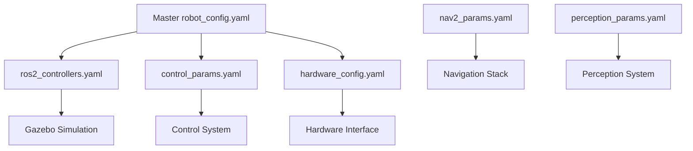

# Configuration Files Reference Guide

This document provides a comprehensive reference for all configuration files in the Dojo robot project.

## Configuration File Organization

Configuration files are organized by package and follow consistent naming conventions:

```
src/
├── robot_control/config/          # Control system configuration
├── robot_gazebo/config/           # Simulation configuration  
├── robot_hardware/config/         # Hardware interface configuration
├── robot_navigation/config/       # Navigation system configuration
├── robot_perception/config/       # Perception system configuration
└── robot_description/config/      # Robot description templates
```

## Configuration File Types

### Parameter Files (`*_params.yaml`)
ROS2 parameter files with `ros__parameters` structure for node configuration.

### Configuration Files (`*_config.yaml`)
System-level configuration files for algorithms and hardware interfaces.

### Controller Files (`*_controllers.yaml`)
ROS2 controller configuration files for the control system.

## Package-by-Package Reference

### Robot Control (`robot_control/config/`)

| File | Purpose | Used By |
|------|---------|---------|
| `control_params.yaml` | Main control system parameters | Control nodes, launch files |
| `arduino_config.yaml` | Arduino interface configuration | Arduino bridge, hardware interface |
| `control_controllers.yaml` | Control system controllers | Controller manager |
| `twist_mux_config.yaml` | Velocity command multiplexing | Twist mux node, safety system |

### Robot Gazebo (`robot_gazebo/config/`)

| File | Purpose | Used By |
|------|---------|---------|
| `ros2_controllers.yaml` | **Active** ROS2 control configuration | Gazebo simulation, URDF |
| `gazebo_controllers.yaml` | Gazebo-specific controller settings | Gazebo plugins |
| `diff_drive_controller.yaml` | Differential drive configuration | Diff drive controller |
| `ekf_config.yaml` | Extended Kalman Filter settings | Robot localization |
| `slam_config.yaml` | SLAM algorithm configuration | SLAM nodes |

### Robot Hardware (`robot_hardware/config/`)

| File | Purpose | Used By |
|------|---------|---------|
| `hardware_config.yaml` | Unified hardware configuration | Hardware drivers, interfaces |
| `rosarduino_bridge_config.yaml` | ROS Arduino Bridge settings | Arduino bridge nodes |

### Robot Navigation (`robot_navigation/config/`)

| File | Purpose | Used By |
|------|---------|---------|
| `nav2_params.yaml` | Complete Nav2 stack configuration | Navigation launch files |
| `bt_navigator_params.yaml` | Behavior Tree navigator | BT navigator node |
| `controller_params.yaml` | Path following controller | Controller server |
| `planner_params.yaml` | Path planning algorithms | Planner server |
| `costmap_common_params.yaml` | Shared costmap parameters | Global/local costmaps |
| `global_costmap_params.yaml` | Global costmap configuration | Global costmap server |
| `local_costmap_params.yaml` | Local costmap configuration | Local costmap server |
| `localization_params.yaml` | Robot localization (AMCL) | Localization nodes |
| `map_server_params.yaml` | Map server configuration | Map server node |

### Robot Perception (`robot_perception/config/`)

| File | Purpose | Used By |
|------|---------|---------|
| `perception_params.yaml` | Flat perception configuration | Utility scripts, tools |
| `robot_perception_params.yaml` | ROS2 perception node parameters | Perception nodes, launch files |

### Robot Description (`robot_description/config/`)

| File | Purpose | Used By |
|------|---------|---------|
| `control_controllers_template.yaml` | Controller configuration template | Reference, hardware deployment |

## Configuration Hierarchy

### Active vs Template Files

**Active Configuration Files** (used at runtime):
- `robot_gazebo/config/ros2_controllers.yaml` - **Primary** controller config
- `robot_perception/config/robot_perception_params.yaml` - **Primary** perception config
- All navigation config files - **Active** navigation configs

**Template/Reference Files**:
- `robot_description/config/control_controllers_template.yaml` - Reference only
- `robot_perception/config/perception_params.yaml` - Utility/script config

### Configuration Dependencies



## Usage Patterns

### Launch File Integration
```python
# Standard pattern for loading configuration
config_file = PathJoinSubstitution([
    FindPackageShare('package_name'),
    'config',
    'config_file.yaml'
])
```

### Parameter Loading in Nodes
```python
# ROS2 parameter loading
self.declare_parameters_from_file('config_file.yaml')
param_value = self.get_parameter('param_name').value
```

### Dynamic Configuration Updates
Some configuration files are automatically updated by the configuration manager:
- `ros2_controllers.yaml` - Updated from master robot config
- Hardware configs - Updated based on detected hardware

## Maintenance Guidelines

### File Naming
- Follow `<functionality>_<type>.yaml` convention
- Use descriptive names that indicate purpose
- Maintain consistency across packages

### Documentation
- Include header comments in all config files
- Document parameter purposes and valid ranges
- Maintain README files in config directories

### Version Control
- Track all configuration changes
- Test configuration changes before committing
- Maintain backup of working configurations

### Safety Considerations
- Always test hardware configurations safely
- Validate parameter ranges and limits
- Use simulation for initial testing

## Troubleshooting

### Common Issues
1. **File Not Found**: Check file paths and naming
2. **Parameter Loading Errors**: Verify YAML syntax
3. **Configuration Conflicts**: Check for duplicate parameters
4. **Performance Issues**: Review update rates and computational parameters

### Validation Commands
```bash
# Check YAML syntax
yamllint config_file.yaml

# Test parameter loading
ros2 param load /node_name config_file.yaml

# Verify configuration in simulation
ros2 launch package_name simulation.launch.py
```

## Migration Notes

Recent configuration file changes:
- `robot_control_params.yaml` → `control_params.yaml`
- `ros2_control.yaml` → `ros2_controllers.yaml`
- `hardware.yaml` → `hardware_config.yaml`
- `arduino.yaml` → `arduino_config.yaml`

Update any custom scripts or launch files to use the new names.