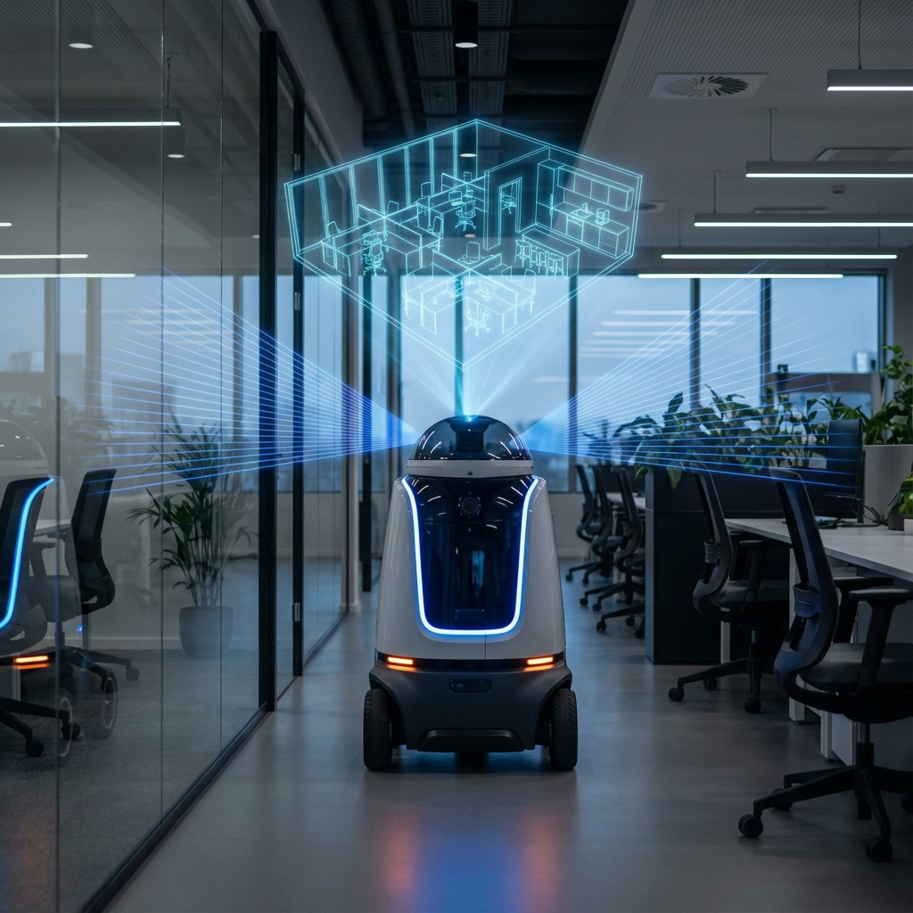
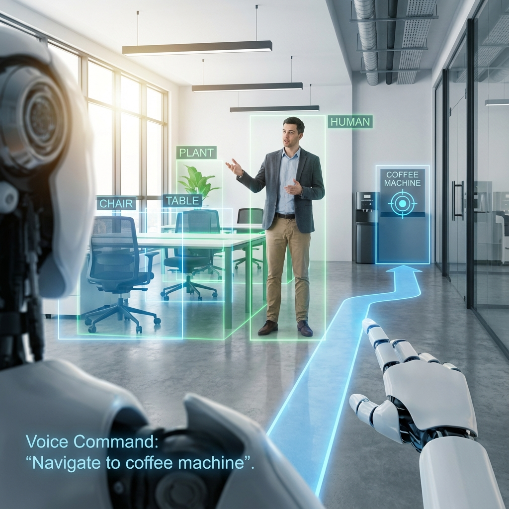

# 🤖 Dojo Robot - Autonomous Navigation & Mapping System

**The Ultimate Platform for Autonomous Exploration, Semantic Understanding, and Photorealistic 3D Reconstruction**

[](https://docs.ros.org/en/jazzy/)
[](https://gazebosim.org/)
[](https://python.org/)
[](https://opensource.org/licenses/MIT)

---

## 🌟 Vision

**Dojo Robot** is not just a navigation stack; it's a comprehensive research and development platform designed to bridge the gap between standard autonomous navigation and next-generation spatial intelligence. Built on the robust **Husarion ROSbot XL** and powered by **ROS 2 Jazzy**, Dojo enables robots to not only map their environment but to *understand* it and capture it in photorealistic detail.

Whether you are creating digital twins, inspecting industrial facilities, or developing advanced semantic navigation behaviors, Dojo provides the modular, high-performance foundation you need.

---

## 🏗️ System Architecture

At the heart of Dojo is a modular, event-driven architecture designed for scalability and robustness. The system is orchestrated by a central launch file (`launch_dojo_rosbot_xl.py`) that manages the lifecycle of all subsystems.


### Core Components

*   **🧠 Perception Layer**: Fuses data from LiDAR, RGB-D cameras, and IMUs to create a coherent understanding of the world.
*   **🗺️ Mapping & Localization**: Utilizes `slam_toolbox` for precise 2D occupancy mapping and robust localization.
*   **🧭 Navigation Stack**: Leverages the industry-standard **Nav2** stack for dynamic path planning, obstacle avoidance, and behavior trees.
*   **🤖 Autonomy Engine**: Custom-built modules for frontier-based exploration (`AutonomousExplorer`) and semantic decision making (`SemanticNavigator`).
*   **📸 3D Reconstruction**: A specialized pipeline for capturing high-quality datasets optimized for **Gaussian Splatting**, enabling the creation of photorealistic 3D scenes.
*   **🛡️ Advanced Safety**: A behavior tree-based safety system that overrides commands when threats are detected (cliffs, dynamic obstacles).

---

## 🚀 Key Features

### 1. Autonomous Frontier Exploration

Forget manual joystick control. Dojo's **Autonomous Explorer** intelligently identifies unknown areas (frontiers) and plans optimal paths to map the entire environment without human intervention.



*   **Algorithm**: DBSCAN clustering for robust frontier detection.
*   **Optimization**: Information gain-based target selection.
*   **Recovery**: Smart recovery behaviors for stuck situations.

### 2. Semantic Navigation

Move beyond "go to (x, y)". Dojo understands objects.



*   **Command**: "Go to the nearest chair."
*   **Logic**: The **Semantic Navigator** queries the semantic map, filters candidate approach points based on the costmap, and navigates to the optimal viewing angle.
*   **Integration**: Seamlessly integrates with YOLO-based object detection systems.

### 3. Gaussian Splatting Optimization

Create stunning 3D digital twins.
*   **Survey Planner**: Executes "crab walk" patterns to maximize parallax and coverage.
*   **Blur Reduction**: Automatically manages velocity and camera exposure to ensure crisp image capture.
*   **Data Pipeline**: Automated workflows for capturing, processing, and training Gaussian Splat models.

---

## 📂 Project Structure

```text
Dojo/
├── launch_dojo_rosbot_xl.py       # MAIN ENTRY POINT: Launches the entire system
├── src/
│   ├── rosbot_xl_gazebo/          # Simulation environment and robot spawn logic
│   ├── rosbot_xl_description/     # URDF, Xacro, and meshes for the robot
│   ├── rosbot_xl_controller/      # Control configurations (Diff Drive / Mecanum)
│   ├── robot_navigation/          # Nav2 configs, Autonomous Explorer node
│   ├── robot_semantic_slam/       # Semantic mapping, YOLO integration, Safety System
│   ├── robot_gaussian_splat/      # Data collection for 3D reconstruction
│   └── husarion_gz_worlds/        # Gazebo worlds (office, warehouse, etc.)
├── scripts/                       # Helper scripts (install dependencies, tools)
└── docs/                          # Documentation and images
```

---

## 🏁 Getting Started

### Prerequisites
*   **OS**: Ubuntu 24.04 (Noble Numbat)
*   **ROS 2**: Jazzy Jalisco
*   **Simulation**: Gazebo Harmonic
*   **Hardware**: Husarion ROSbot XL (optional, but recommended)

### Installation

```bash
# 1. Clone the repository
git clone https://github.com/your-org/Dojo.git
cd Dojo

# 2. Install dependencies
./scripts/install_dependencies.sh

# 3. Build the workspace
colcon build --symlink-install

# 4. Source the environment
source install/setup.bash
```

### 🎮 Running the Simulation

**Full System Demo (SLAM + Nav2 + Exploration)**
```bash
ros2 launch launch_dojo_rosbot_xl.py \
    world:=office \
    slam:=true \
    navigation:=true \
    autonomous_exploration:=true \
    gui:=true \
    rviz:=true
```

**Mecanum Drive Mode (Experimental)**
```bash
ros2 launch launch_dojo_rosbot_xl.py mecanum:=true navigation:=true
```
*Note: Mecanum drive is stable but currently has a known limitation with Odometry publication in Gazebo Harmonic.*

---

## 🔧 Troubleshooting

### Common Issues

1.  **"NameError: name 'autonomous_explorer' is not defined"**
    *   **Fix**: This has been resolved in the latest release. Ensure you have sourced the workspace (`source install/setup.bash`) after building.

2.  **Robot not moving with Teleop**
    *   **Cause**: Conflict between `ros_gz_bridge` and `gz_ros2_control` on the `/cmd_vel` topic.
    *   **Fix**: The bridge for `/cmd_vel` is now disabled by default in `spawn.launch.py` to allow the controller to handle commands directly.

3.  **Gazebo crashes on launch**
    *   **Fix**: Ensure `gpu_lidar` is used and the world file has the `<render_engine>ogre2</render_engine>` tag in the sensors plugin.

---

## 🤝 Contributing

We welcome contributions! Whether it's fixing a bug, adding a new feature, or improving documentation, your help is appreciated.

1.  Fork the Project
2.  Create your Feature Branch (`git checkout -b feature/AmazingFeature`)
3.  Commit your Changes (`git commit -m 'Add some AmazingFeature'`)
4.  Push to the Branch (`git push origin feature/AmazingFeature`)
5.  Open a Pull Request

---

## 📄 License

Distributed under the MIT License. See `LICENSE` for more information.

---

**Dojo Robot** — *Redefining Autonomous Navigation.*
