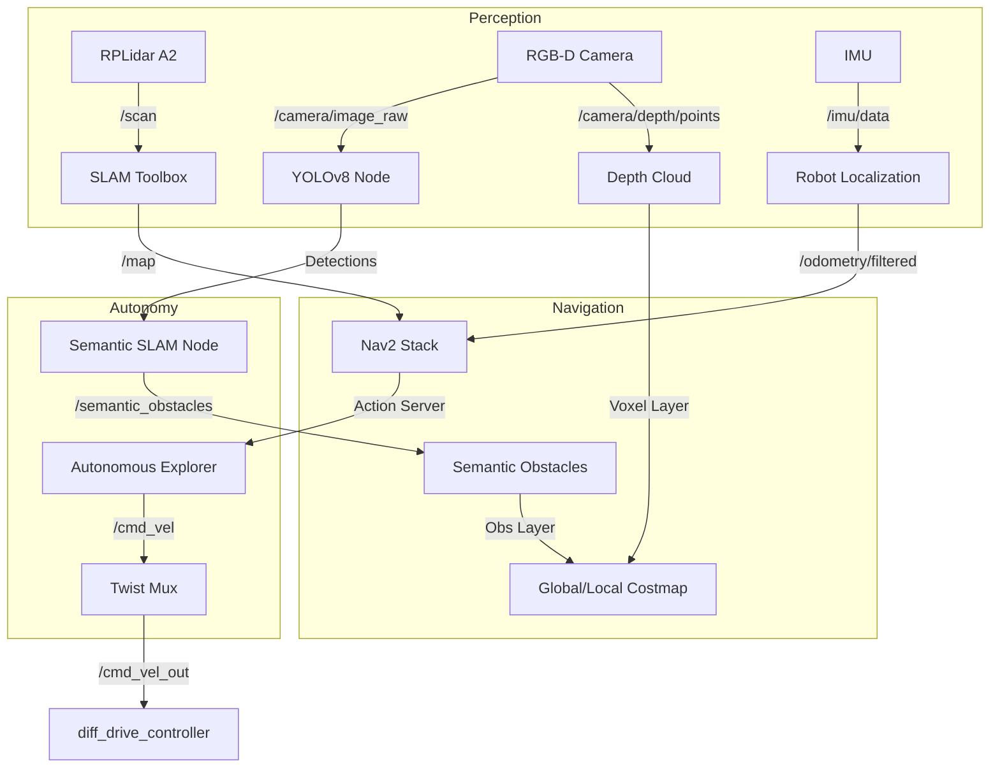

# 🥋 Dojo Robot: Advanced Autonomous Navigation & Semantic Understanding

**The Ultimate Platform for Autonomous Exploration, Semantic Mapping, and Photorealistic 3D Reconstruction.**

[](https://docs.ros.org/en/jazzy/)
[](https://gazebosim.org/)
[](https://python.org/)
[](https://opensource.org/licenses/MIT)

---

## 📖 Table of Contents
1.  [System Architecture](#-system-architecture)
2.  [Core Algorithms](#-core-algorithms)
    *   [Autonomous Frontier Explorer](#1-autonomous-frontier-explorer)
    *   [Semantic Semantic SLAM](#2-semantic-slam--obstacle-avoidance)
3.  [Engineering Challenges & Solutions](#-engineering-challenges--solutions)
4.  [Installation & Usage](#-getting-started)
5.  [Troubleshooting](#-troubleshooting)

---

## 🏗️ System Architecture

Dojo is built on a modular, event-driven architecture powered by ROS 2 Jazzy. The system is divided into three primary layers: **Perception**, **Navigation**, and **Autonomy**.



### Key Subsystems
1.  **Perception Layer**: Fuses 2D Laser Scans (for mapping) with 3D Depth Pointclouds (for obstacle avoidance) and Semantic Detections (YOLO).
2.  **Navigation Stack**: A highly tuned **Nav2** implementation using DWB Local Planner and Smac Hybrid Global Planner.
3.  **Autonomy Engine**: Custom Python-based logic for deciding *where* to go (Exploration) and *what* to investigate (Semantic Navigation).

---

## 🧠 Core Algorithms

### 1. Autonomous Frontier Explorer
The `AutonomousExplorer` node (`src/robot_navigation/robot_navigation/autonomous_explorer.py`) allows the robot to map unknown environments without human intervention.

#### **How it Works:**
1.  **Frontier Detection**:
    *   The robot analyzes the Occupancy Grid (`/map`).
    *   It identifies "edges" between Known Free Space and Unknown Space using Computer Vision techniques (Canny Edge Detection + Morphological Dilation).
2.  **Clustering (DBSCAN)**:
    *   Raw frontier points are clustered using **DBSCAN** (Density-Based Spatial Clustering of Applications with Noise).
    *   This groups scattered pixels into distinct "Frontier Targets" (e.g., a doorway, a hallway end).
3.  **Target Selection (The "Brave" Score)**:
    *   Each cluster is scored based on:
        *   **Distance**: Closer is better (Efficiency).
        *   **Information Gain**: How much unknown space encompasses it?
        *   **Safety**: Is it reachable without collision?
    *   *Equation*: `Score = (InfoGain * 0.5) - (Distance * 2.0)`

#### **The "Braver" Logic (Implemented v2.0):**
Early versions of the robot were "timid," giving up on frontiers if path planning failed once. We solved this with a state-based retry mechanism:
*   **3-Strike Rule**: The robot retries a failed frontier **3 times** before blacklisting it.
*   **Surgical Blacklisting**: If a point is unreachable, we only blacklist a small radius (**0.75m**) around it, allowing the robot to try immediate neighbors.
*   **Relaxed Safety**: The internal safety check buffer was reduced to **1.2x Robot Radius** (down from 1.5x), allowing the robot to attempt squeezing through tight gaps.

### 2. Semantic SLAM & Obstacle Avoidance
The `SemanticSLAMNode` (`src/robot_semantic_slam/robot_semantic_slam/semantic_slam_node.py`) bridges the gap between seeing an object and navigating around it.

#### **Semantic Mapping Pipeline:**
1.  **Detection**: YOLOv8 runs on the RGB stream to detect objects (Chairs, Tables, People).
2.  **3D Projection**: Using the robot's localized pose (`/tf`) and the camera's depth, we project the 2D bounding box into 3D world coordinates.
3.  **Visualization**: Objects are visualized in RViz with floating Text Tags reading from `/semantic_labels`.

#### **Dynamic Obstacle Injection (The "Ghost" Objects):**
Lidar often misses table legs or open chair frames. To fix this, we implemented **Semantic Costmap Injection**:
*   When a "Chair" is detected at `(x, y)`, the node publishes a synthetic **PointCloud2** cylinder at that location to the topic `/semantic_obstacles`.
*   **Nav2 Integration**: The Global and Local Costmaps subscribe to this topic.
*   **Result**: The navigation stack treats the "Concept of a Chair" as a physical concrete wall, forcing the planner to route around it even if the Lidar sees empty space.

---

## 🛠️ Engineering Challenges & Solutions

| Challenge | Symptom | Implemented Solution |
| :--- | :--- | :--- |
| **The "Indecisive Robot"** | Robot would stop, turn left, turn right, and hesitate in hallways. | **Gradient Smoothing**: We reduced the `cost_scaling_factor` in Nav2 from `10.0` (Sharp) to **`5.0` (Smooth)**. This creates a gentle "potential field" around obstacles, allowing the local planner to make smooth adjustments rather than binary stop/go decisions. |
| **Tight Spaces** | Robot refused to enter narrow office doors (70cm width). | **Aggressive Tuning**: We reduced the configured `robot_radius` to **0.19m** (physically 0.20m) and lowered `inflation_radius` to **0.25m**. This "lies" slightly to the planner, permitting it to attempt maneuvers with only centimeters of clearance. |
| **Invisible Obstacles** | Robot rammed into office chairs with thin legs. | **Depth Camera Fusion**: We integrated `/camera/depth/color/points` into the Nav2 Voxel Layer. This allows the robot to perceive 3D structures (overhangs, thin legs) that the 2D Lidar slice misses. |
| **Simulation Time Drift** | TF errors and "Transform too old" warnings. | **IMU Bridge**: We wrote a custom bridge `imu_to_clock.py` (later replaced by native `gz_bridge` config) to ensure the simulation clock (`/clock`) synchronization with the IMU sensor rate, stabilizing the EKF. |

---

## 🏁 Getting Started

### Prerequisites
*   **OS**: Ubuntu 24.04 (Noble Numbat)
*   **ROS 2**: Jazzy Jalisco
*   **Simulation**: Gazebo Harmonic

### Installation
```bash
git clone https://github.com/your-org/Dojo.git
cd Dojo
./scripts/install_dependencies.sh
colcon build --symlink-install
source install/setup.bash
```

### 🎮 Running the System

**1. The "All-in-One" Launch:**
This command launches Gazebo, Spawn the Robot, Starts Nav2, SLAM, and the Autonomous Explorer.
```bash
ros2 launch launch_dojo_rosbot_xl.py \
    world:=src/robot_gazebo/worlds/office_fixed.sdf \
    slam:=true \
    navigation:=true \
    autonomous_exploration:=true
```

**2. Monitoring:**
*   **RViz**: Automatic visualization of Map, Frontiers (`/exploration_frontiers`), and Semantic Objects (`/semantic_markers`).
*   **Terminal**: Colorful logs regarding "Frontier Selection" and "Semantic Detections".

---

## 🔧 Troubleshooting

*   **Robot spins in circles?**
    *   This is the "Gaussian Splat" capture mode. Verify `gaussian_splat_mode` parameter is set to `False` in `autonomous_explorer.py` if not desired.
*   **"Frontier blacklisted" constantly?**
    *   The robot might be trapped. Check the "Braver" logic settings. You can reset the blacklist by manually clearing the `failed_frontiers` list in code or restarting the node.
*   **Map "tearing" or shifting?**
    *   This indicates Lidar slippage or Odometry drift. Ensure the simulation is running at real-time speeds (Real Time Factor > 0.8). If simulation is lagging, switch to "Headless Mode" by adding `gui:=False` to the launch command.
