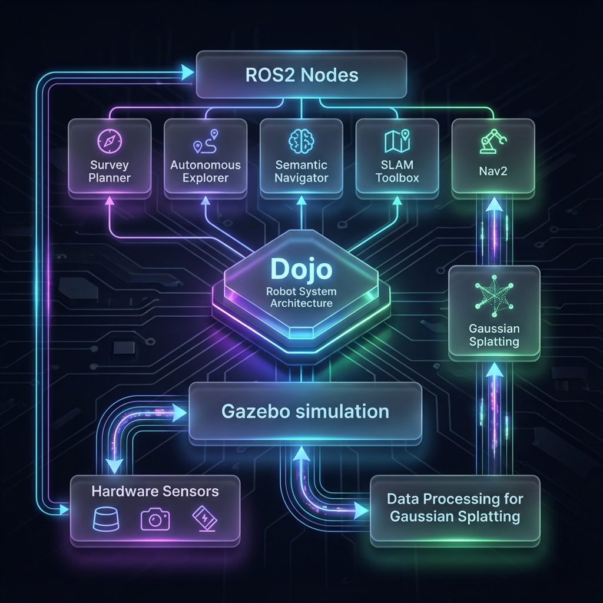

# 🤖 Dojo Robot - Autonomous Navigation & Mapping System

**The Ultimate Platform for Autonomous Exploration, Semantic Understanding, and Photorealistic 3D Reconstruction**

[](https://docs.ros.org/en/jazzy/)
[](https://gazebosim.org/)
[](https://python.org/)
[](https://opensource.org/licenses/MIT)

---

## 🌟 Vision

**Dojo Robot** is not just a navigation stack; it's a comprehensive research and development platform designed to bridge the gap between standard autonomous navigation and next-generation spatial intelligence. Built on the robust **Husarion ROSbot XL** and powered by **ROS 2 Jazzy**, Dojo enables robots to not only map their environment but to *understand* it and capture it in photorealistic detail.

Whether you are creating digital twins, inspecting industrial facilities, or developing advanced semantic navigation behaviors, Dojo provides the modular, high-performance foundation you need.

---

## 🏗️ System Architecture

At the heart of Dojo is a modular, event-driven architecture designed for scalability and robustness.



### Core Components

*   **🧠 Perception Layer**: Fuses data from LiDAR, RGB-D cameras, and IMUs to create a coherent understanding of the world.
*   **🗺️ Mapping & Localization**: Utilizes `slam_toolbox` for precise 2D occupancy mapping and robust localization.
*   **🧭 Navigation Stack**: Leverages the industry-standard **Nav2** stack for dynamic path planning, obstacle avoidance, and behavior trees.
*   **🤖 Autonomy Engine**: Custom-built modules for frontier-based exploration (`AutonomousExplorer`) and semantic decision making (`SemanticNavigator`).
*   **📸 3D Reconstruction**: A specialized pipeline for capturing high-quality datasets optimized for **Gaussian Splatting**, enabling the creation of photorealistic 3D scenes.

---

## 🚀 Key Features

### 1. Autonomous Frontier Exploration
Forget manual joystick control. Dojo's **Autonomous Explorer** intelligently identifies unknown areas (frontiers) and plans optimal paths to map the entire environment without human intervention.
*   **Algorithm**: DBSCAN clustering for robust frontier detection.
*   **Optimization**: Information gain-based target selection.
*   **Recovery**: Smart recovery behaviors for stuck situations.

### 2. Semantic Navigation
Move beyond "go to (x, y)". Dojo understands objects.
*   **Command**: "Go to the nearest chair."
*   **Logic**: The **Semantic Navigator** queries the semantic map, filters candidate approach points based on the costmap, and navigates to the optimal viewing angle.
*   **Integration**: Seamlessly integrates with YOLO-based object detection systems.

### 3. Gaussian Splatting Optimization
Create stunning 3D digital twins.
*   **Survey Planner**: Executes "crab walk" patterns to maximize parallax and coverage.
*   **Blur Reduction**: Automatically manages velocity and camera exposure to ensure crisp image capture.
*   **Data Pipeline**: Automated workflows for capturing, processing, and training Gaussian Splat models.

---

## 💡 Real-World Use Cases

### 🏠 Real Estate & Digital Twins
**Scenario**: A real estate agency needs high-fidelity 3D tours of properties.
*   **Dojo Solution**: Deploy a Dojo-powered robot to autonomously scan the property. The **Survey Planner** ensures 100% coverage with optimal camera angles. The resulting data is processed into a Gaussian Splat, allowing potential buyers to explore the property in photorealistic 3D from their browser.

### 🏭 Industrial Inspection
**Scenario**: A warehouse manager needs to verify inventory and check for safety hazards.
*   **Dojo Solution**: The robot performs nightly autonomous patrols. Using **Semantic Navigation**, it visits specific high-value assets ("Go to Rack A", "Inspect Generator"). If it encounters an unexpected obstacle, it dynamically replans.

### 🏥 Healthcare Logistics
**Scenario**: A hospital robot needs to deliver supplies to specific rooms.
*   **Dojo Solution**: Instead of hardcoded coordinates, the robot uses semantic understanding. "Deliver to Room 101". The system looks up "Room 101" in its semantic map, plans a path, and navigates safely around patients and staff using Nav2's dynamic obstacle avoidance.

---

## 📦 Modules Breakdown

### `dojo_navigation`
The brain of the movement.
*   **`survey_planner`**: Generates coverage paths (lawnmower, spiral) for data collection. Implements the "crab walk" control logic.
*   **`autonomous_explorer`**: The decision maker for mapping unknown environments.

### `dojo_semantic`
The layer of understanding.
*   **`dynamic_navigator`**: Handles high-level semantic goals. Interfaces with the costmap to ensure approach points are reachable and safe.
*   **`semantic_map_manager`**: (Planned) CRUD operations for the semantic database.

### `robot_navigation` & `robot_gazebo`
The foundation.
*   **Launch Files**: Modular launch system for simulation and hardware.
*   **Configs**: Tuned parameters for Nav2 and SLAM.

---

## 🏁 Getting Started

### Prerequisites
*   **OS**: Ubuntu 24.04 (Noble Numbat)
*   **ROS 2**: Jazzy Jalisco
*   **Simulation**: Gazebo Harmonic
*   **Hardware**: Husarion ROSbot XL (optional, but recommended)

### Installation

```bash
# 1. Clone the repository
git clone https://github.com/your-org/Dojo.git
cd Dojo

# 2. Install dependencies
./scripts/install_dependencies.sh

# 3. Build the workspace
colcon build --symlink-install

# 4. Source the environment
source install/setup.bash
```

### 🎮 Running the Simulation

**Full System Demo (SLAM + Nav2 + Exploration)**
```bash
ros2 launch launch_dojo_rosbot_xl.py \
    world:=office \
    slam:=true \
    navigation:=true \
    autonomous_exploration:=true \
    gui:=true \
    rviz:=true
```

### 🤖 Running on Hardware

**Deploy to ROSbot XL**
```bash
ros2 launch launch_dojo_rosbot_xl_hardware.py \
    slam:=true \
    navigation:=true
```

---

## 📊 Configuration & Tuning

Dojo is highly configurable. Key parameters can be found in `config/`:

*   **`nav2_params.yaml`**: Adjust robot speed, inflation radius, and costmap layers.
*   **`slam_config.yaml`**: Tune map resolution and update frequencies.
*   **`autonomous_exploration.yaml`**: Set frontier detection thresholds and exploration boundaries.

---

## 🤝 Contributing

We welcome contributions! Whether it's fixing a bug, adding a new feature, or improving documentation, your help is appreciated.

1.  Fork the Project
2.  Create your Feature Branch (`git checkout -b feature/AmazingFeature`)
3.  Commit your Changes (`git commit -m 'Add some AmazingFeature'`)
4.  Push to the Branch (`git push origin feature/AmazingFeature`)
5.  Open a Pull Request

---

## 📄 License

Distributed under the MIT License. See `LICENSE` for more information.

---

**Dojo Robot** — *Redefining Autonomous Navigation.*
